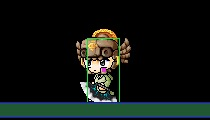
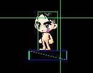

# Todo list

- [ ] 理解角色素材的拼接算法进度 90%
	- [x] zmap 的素材层次
	- [x] 素材渲染解耦
	- [x] 角色动作解析器（输入一个动作序列，角色能够进行动作自由播放）
		- [x] 优化眼睛的动作变化
		- [x] 进一步优化动作解析的性能
	- [ ] 技能动画编写
	- [ ] 角色状态及封装，使用状态机或者 ECS
- [x] 敌人解析与封装 60%
	- [ ] 完成了动画封装
- [ ] 地图解析与封装
- [ ] UI解析
- [x] 寻找 wz 文件转 json 文件的办法，现在的资源都比较有限，需要规模地完成转化，并通过后端服务器进行资源服务。
- [ ] 网络同步方案
	- [ ] 了解 Elixir Phoenix 

# Changelog
All notable changes to this project will be documented in this file.

The format is based on [Keep a Changelog](https://keepachangelog.com/en/1.0.0/),
and this project adheres to [Semantic Versioning](https://semver.org/spec/v2.0.0.html).

## [0.1.1] - 2022-03-15
使用 Phaser 原生的 Sprite 动画，及其回调来绘制冒险岛的动画，这是一个更加有效的动画绘制方案。
### Added
- 增加了怪物的动画封装，已经可以通过 API 播放怪物的动画；


### Refactor
- 人物的动作解析库重新编写，优化了 api，进度达到 90%
### Removed
- 删除之前编写的动画逻辑


## [0.1.0] - 2022-01-02
### Added
- 编写了人物的动作解析库和动作播放器，并完成了 api 开发。
### Removed
- 删除一些废弃的代码

## [0.0.3] - 2021-12-24
### Changed
- 重构 Player 类，是用继承的方式实现 GameObject
### Added
- 实现角色 flip 转向效果
## Removed
- 删除一些旧的测试代码

## [0.0.2] - 2021-12-23
### Changed 
- 放弃使用国服 180+ 的版本，因为里面的资源实在太大了，感觉很多资源都是无效的
- 将资源的访问统一的到其他静态资源服务器上，客户端变得更加轻量级
### Added 
- 079 客户端版本的资源转换方案，同学们可以自己下载 079 的客户端，然后通过简单的[脚本](./xmlchanger.js)，将 xml 文件，适配本项目需要的 json 文件
### Removed 
- 删除一些旧的测试代码

## [0.0.1] - 2021-12-22 
### Added
- 初始化 Changelog

## 2021-12-21
* 重构角色素材粘贴相关的工作，代码量减少，下一步是设计角色动作解析器。关于这个，我是这样理解的：
1. 允许输入一个序列的 action/frame/delay ，角色将会通过此序列进行播放动作。
2. 这种序列分循环序列、单个序列、一次性序列

## 2021-12-20
* 这两天在关于网络同步的方案，发现 Elixir 的 Phoenix 也适用此同步方案，github 上有类似的 [demo 项目](https://github.com/sergioaugrod/uai_shot)。要完成这部分的工作，需要调研一下 Phoenix 框架。
* 另外 Youtube 上也有类似的介绍，这是 2016 年的 Elixir 大会上的[分享](https://www.youtube.com/watch?v=I5L9_cXwBcU)，里面也提到了目前同步方案可能带来的超量广播问题，这个可以通过控制服务端的同步频率来解决。

## 2021-12-18
* 今天早上主要解决 zmap 的拼接顺序问题，发现在使用了 Phaser 的 container 后，Sprite 的 depth 是不能使用的。论坛上有[相关的讨论](https://phaser.discourse.group/t/container-sorting/4479)，最终在里面找到了答案。改用在 update 后进行一次 depth 的 sort 对 container 内的 sprite 做一次排序，就可以完成素材层次上的粘贴了。
* 基于这个工作，后面的素材粘贴就可以自由很多了，不需要再考虑粘贴顺序。
* 角色素材粘贴的工作已经知悉差不多了，下一步考虑角色素材粘贴重构的工作。

<div align="center">
	
</div>

## 2021-12-16
* 抽空思考了一下关于游戏的网络同步问题，有状态同步和帧同步两种。这次使用的主要是帧同步，每 60ms 直接同步一次客户端的 GameObject 位置及物理引擎的参数，动作应通过序列方式进行传输，每个玩家的位置及物理数据都由玩家的客户端控制和计算。这样的坏处是：无法做到玩家间的 PK，因为各自的物理场景都是自己的客户端计算出来的，除非有服务器做状态同步相关。也可以考虑使用某些场景，在服务器做运算，再通过状态同步到客户端，这样就是 Room 的概念，在 Room 内就可以做到公平 PK 了
* 还有怪物的行为及同步，目前还没有很好的办法，主要是怪物的同步行为暂时不清楚以哪个来做运算。

## 2021-12-14
* 下午花了一点时间渲染了角色的帽子，比较顺利。同时发现 zmap 是素材粘贴的顺序，但是 phaser 是一个 2d 引擎，在 z 维度上暂时没找到很好的支持，需要花点时间调研一下。

* 晚上为了方便调试，做了一个比较简单的移动动画。目前来看，整体的粘贴算法是正确的，问题是素材的层次错误。虽然 Phaser 提供了 depth 的参数，但使用后并没有作用，需要分析一下原因。

* 另外拼接算法现在是不同部位各自编写的，但在编写过程中，发现大量的算法是重复的。
* Flip 没有实现，需要思考一下
* 考虑使用 ECS 去做素材粘贴，前提是 zmap 的层次问题先被解决。

（整体来说，今天的进度还不错）

## 2021-12-4
周末起来，进行了眼睛和头发的渲染，整体来说还算顺利。但是整个拼接逻辑依然没有很清楚。主要是直接采用了[这个仓库的算法](https://github.com/Elem8100/MapleStory-GM-Client/blob/ab96724341093b620b6c803cc1437c32d4441f59/Src/MapleCharacter.pas#L1352)。

<div align="center">
	
</div>

## 2021-12-2
阅读了一下 Phaser3 的 [Example](https://phaser.io/examples/v3)，联想了一下关于 Mapestory 的资源，顾有以下笔记

### Scene
1. Scene 模块中，里面设计了一个 UI Scene 的设计。这个 UI Scene 可以用于注册和相应 Game Scene 的事件，例如获得经验，扣血等。
2. Scene 的生命周期，假如我将 MapleStory 的 Map 定义一个 Scene，那么 Scene 的生命周期应该可以被 create、change、**destroy**，Game 是可以[动态加载](https://phaser.io/examples/v3/view/scenes/add-scene-after-gam) scene 的。
3. 所以我们需要可以做到，根据一个 sceneId 构建一个 Scene 对象，初始化的时候，可以加在并渲染一个地图。这是一个封装的工作。

### GameObject
1. Blitter 设计是用于加快渲染速度的，加入担心渲染速度会产生性能问题，可以考虑使用这组件；
2. Container 

## 2021-11-28

利用周末开始研究了一下素材拼接的代码。

1. 每个部位都有自己的公式，取决于 wz_node 的数据，两份代码的实现，暂时都是硬编码这些公式。
2. 目前使用刷新 Sprite 的方法比粗暴，后面有需要得优化一下。初步的方案是，通过动画生成器，创建角色所有的动画素材，而不是不断地生成 Sprite。因为加载所有的资源后，所有的动作也可以被生成了。这样的坏处是：每更改一件装备，都需要等待所有动作被重新生成，带来的体感会非常差。
3. 基本上重写了 DataLoader 部分，目前来看，使用应该容易了
4. zmap 看起来是渲染层次的代码，但可以通过按一定的顺序渲染部位
5. 虽然自己调试好了部分位置，但和朋友给的算法并不一致，（但和网上有其他代码是一致的），需要清楚为什么出现不一致。
6. Phaser Container 作为容器渲染角色，需要进一步阅读这部分的文档。
7. 截图是周末的工作结果，暂时粘贴了三个位置【body、arm、head】

<div align="center">
	
</div>

## 2021-11-24

今天得到一个 B 站复刻冒险岛的同学帮助，得到了素材拼接算法的代码，[CharacterLoader.cs](./CharacterLoader.cs) 和 [CreatPlayer.cs](./CreatPlayer.cs)。后面会花时间阅读清楚整个绘制过程。然后写一下 wiki 。


## 2021-11-23

今晚继续调研了一下关于冒险岛角色绘制的问题。从 B 站找到了一个非常惊艳的 [demo](https://www.bilibili.com/video/BV1Nf4y1M7F6?spm_id_from=333.999.0.0)。然后稍微深入了解了一下游戏动画的制作，大概可以分为：[帧动画和骨骼动画](https://www.zhihu.com/question/50976782)。

冒险岛属于通过一定的公示，将素材拼接成每一帧，然后再进行自由的动画组合。属于帧动画，但也具备了部分骨骼动画的好处，可以非常容易地扩展角色的外貌。cool!

同时从这个 [github 的仓库中找到了冒险岛骨骼动画的代码](https://github.com/Kagamia/WzComparerR2)，暂时没深入阅读。暂时决定还是先深入了解清楚整个骨骼动画的原理再考虑深入写代码。


## 2021-11-22

今晚在尝试重写资源加载部分。这是前置于游戏资源逻辑的工作。遇到以下问题，及思考。

我参照 HeavenClient 的客户端代码，发现它的代码大多数基于文件加载的同步方式进行的。这是因为它的资源都在本地。如果要将资源运行在 web 上，则需要考虑加载问题。

1. 在 TS + Web 中，异步和同步应该如何抉择？
2. HeavenClient 使用的数据大量都是同步获得的，所以进行比较简单。
3. 同步获得的过程是不是应该在游戏运行前的资源加载部分先完成？需要思考一下。

* 比较大的问题，对于资源的使用，在 web 上一定要通过回调的方式进行使用么？这里会有一个回调地狱的陷阱。 HeavenClient 主要都是通过同步的方式进行的。
* 这里也可以考虑到一个问题：大部分的游戏都是先加载好资源，然后再运行的，这样有利于代码的简单。（同步代码总是比异步代码简单）
* 假如决定使用异步方式使用资源，应该如何写呢？异步方式可能也很优雅？
* 有没有可能使用同步的方式去使用这些资源？


## 2021-11-21 
* 阅读 HeavenClient 关于 Character 的逻辑
* 阅读了部分代码，发现其需要先实现 BodyDrawInfo ，再用于计算其他素材的。
* 实现 BodyDrawInfo 前，需要先实现 Stance 枚举及其接口
* 由于不熟悉 TS 的语法，所以代码需要 Unit Test 进行编写。
* 在编写 Unit test 发现了如下错误
```
SyntaxError: Cannot use import statement outside a module
```
最后在 github 上的这个 issue 上找到解决方法。https://github.com/TypeStrong/ts-node/issues/922#issuecomment-667076602

## 2021-11-21 重启此项目
